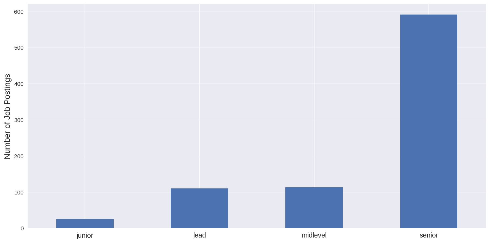
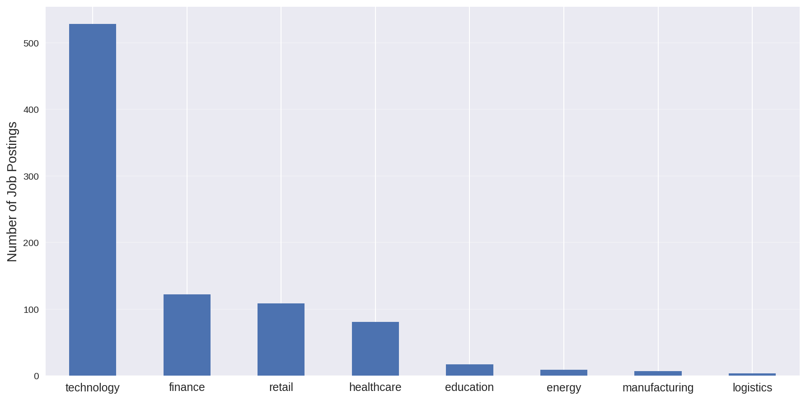
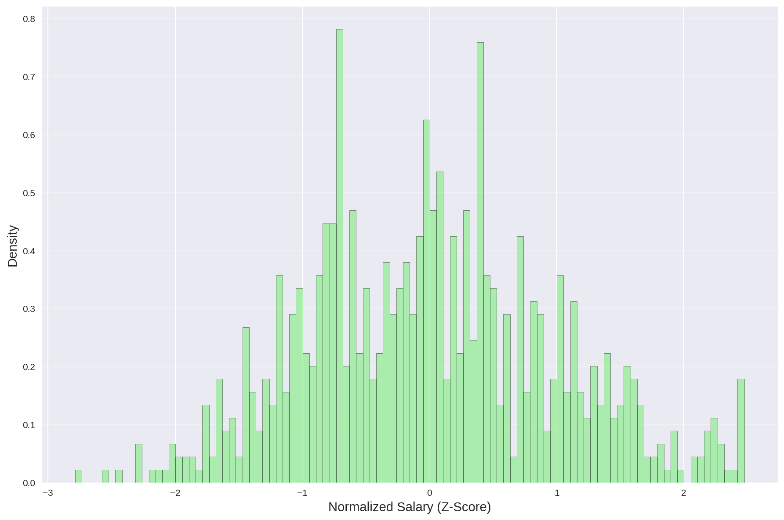
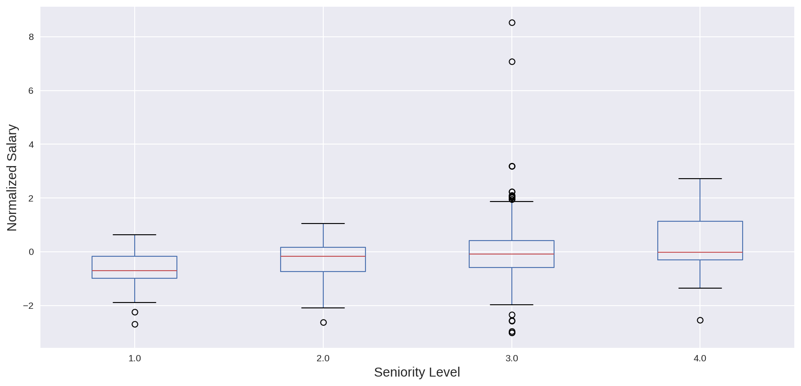
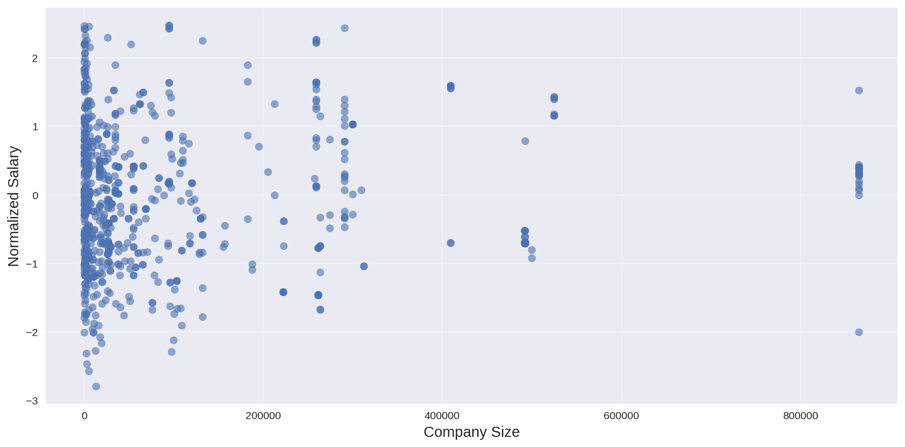
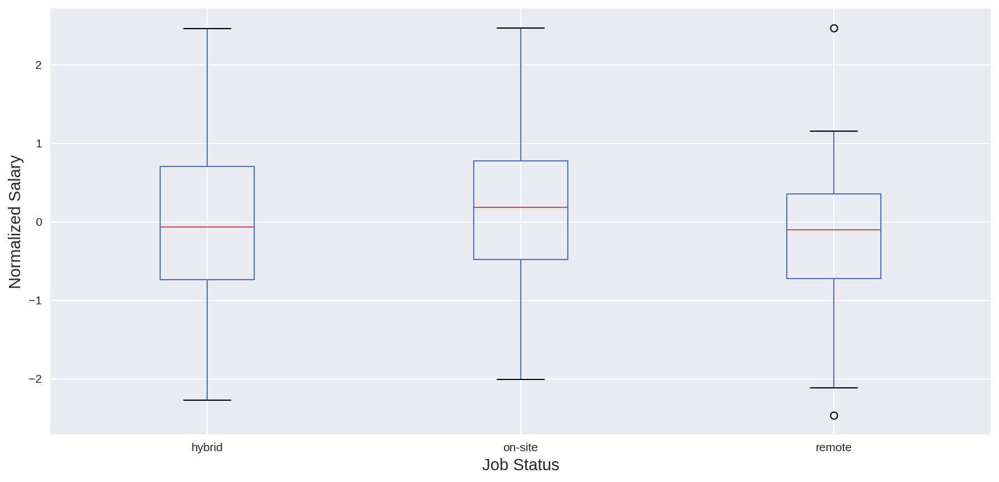
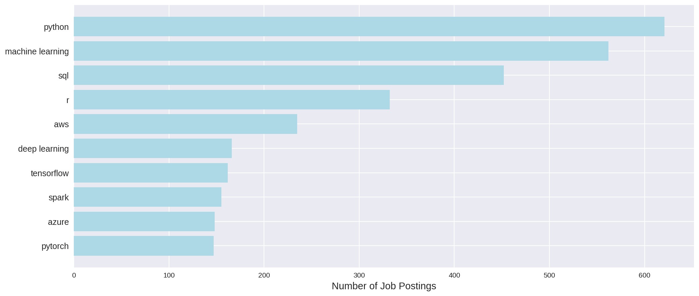
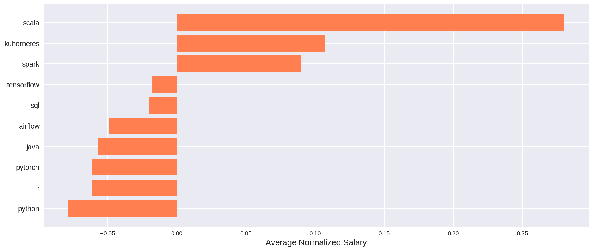

# Data Science Job Posts and Salaries Analysis

Sergei Volkov

---

## Toolset

- Python + Pandas
- matplotlib and Seaborn for plotting
- Marp to create this presentation in Markdown

---

## Project Overview

### Dataset

- Data Science Job Posts and Salaries 2025, collected in October
- Features: job titles, skills, salary, location, company details
- Job posting from publicly available sources across the globe

---

## Data cleaning

- Location includes
  - US states w/o country code or name
  - ISO3166 codes and full country names
  - Remote status
- Numbers in US locale
- Revenue in 7.28M format
- Some non-money numbers contained € sign
- Post date in human but not machine friendly "a month ago" format
- Salary as ranges (not always)
- Skills contains synonyms (AWS and Amazon, sklearn and scikit-learn)

---

## Huge difference in salary

- Variance between countries is expected
  - Dataset includes jobs in high and low income countries
  - It is normal though makes it hard to compare salaries directly
- Some jobs state outstanding salaries
  - Including 2 with €2M+ in India and €8K in US
  - Extreme values are most probably errors (e.g. wrong currency, not full-time positions)

---

## Data Processing Methodology

### Geographic Normalization
- Z-score normalization by country: `(salary - mean) / std` for each country
- Eliminates geographic salary variations
- Enables fair skill comparison across markets

### Outlier Handling
- *IQR filtering*: Remove extreme values outside `Q1 - 1.5×IQR` to `Q3 + 1.5×IQR`
- Applied separately for each country
- Preserves legitimate salary variations while removing extreme outliers

---

## Everyone wants seniors

---

## Job posts by industry

---

# Salary analysis

---

## Salary Distribution Analysis

### Before Filtering

### After Filtering and Normalization

---

## Impact of Seniority on Compensation

---

## Company Size vs Salary Impact

---

## Remote Status impact

---

# Skill analysis

---

## Skill Prevalence: Top 10 Most Common Skills

---

## Skill Value Analysis: Top 10 Highest Paying Skills

---

## Conclusions

- *Seniority* strongly correlates with compensation
- *Company size* affects salary variability

### For Job Seekers

- Specialized skills (Scala, kubernetes) at high paid jobs
- You have to go to the office for better salary

### For Employers

- Market salary expectations vary significantly by skill
  - It may be cheaper to separate DevOps and Data Engineering roles from Data Science
- Remote work can attract talent without geographic constraints

---

## Analysis further steps

- Predictive modeling for salary estimation
- Collect data from sources like Glasdoor to calculate expected salary
- Correlation between skill combinations and compensation
- Obtain time-series for trend analysis
